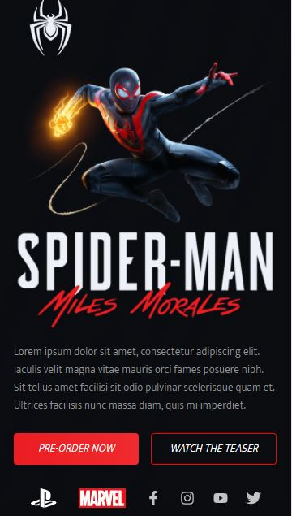

<h1 align="center">
Spider Man - Miles Morales
</h1>

### Web
<h1 align=center>

</h1>

### Mobile
<h1 align=center>

</h1>

Para acessar o projeto clique <a href="discord-clone.ma-nobrega.vercel.app/">aqui</a>.

## Tecnologias

- [x] React.js
- [x] Styled Components
- [x] TypeScript

## Como rodar (execute via terminal/cmd)

1. `npm install` ou `yarn install`. 
2. `yarn start`. 
3. Acesso pelo navegador `http://localhost:3000`. 

## Agradecimentos

Conteudo no Figma:<a href="https://www.figma.com/file/zm3fLTS6fk4gaYzaCWhMaw/Spider-man?node-id=1%3A3">Clique aqui</a>
<a href="https://www.nyousefali.com.br/">NYousefali</a>, obrigado pelo conteúdo disponibilizado!
